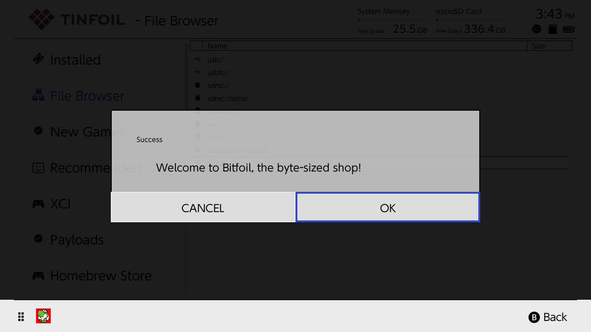

# Bitfoil

Set up a self-hosted Tinfoil shop to install backups of your games and updates from your computer onto your Switch over your network.

## Deployment

Modify the variables in the .env file, then run it using Docker Compose.

```bash
docker compose -f ./docker-compose.yaml up -d --no-deps --build
```


## Screenshots





